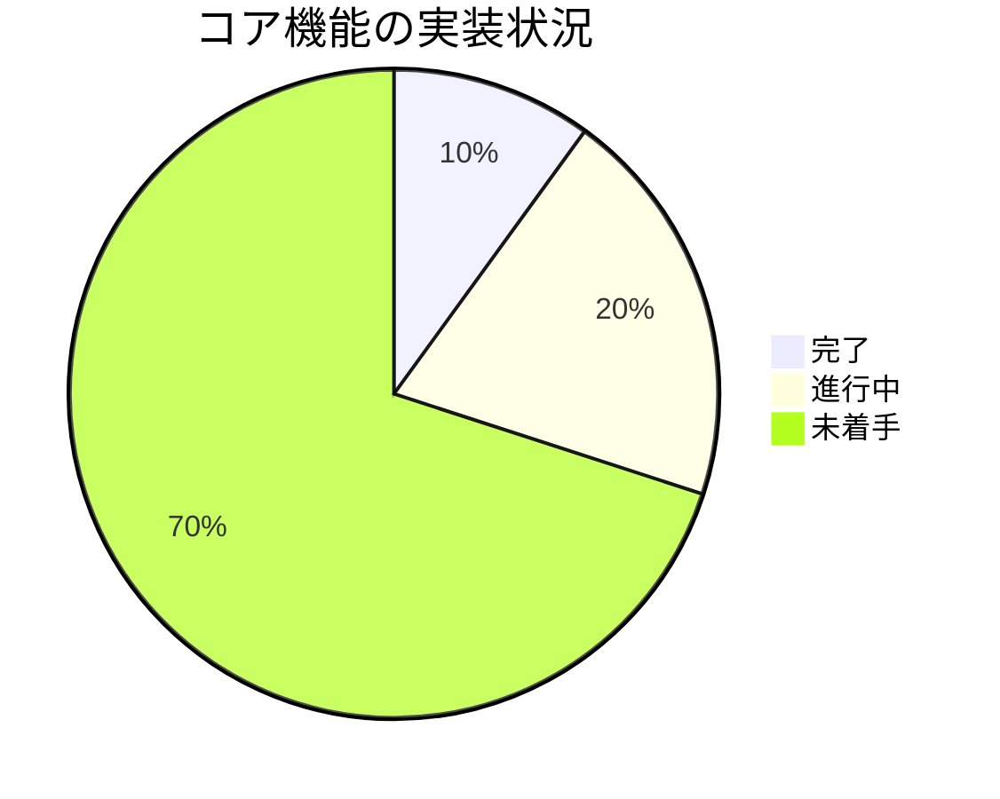
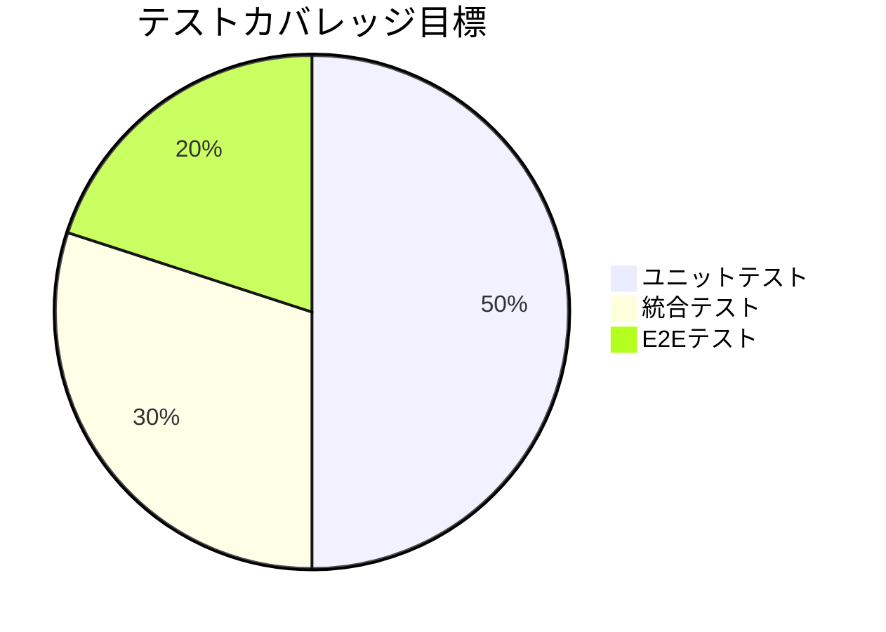

# 進捗状況

## 現在の進捗

### プロジェクト初期化フェーズ
- [x] プロジェクトの要件定義
- [x] アーキテクチャ設計
- [x] 技術スタックの選定
- [x] Memory Bankの作成
- [ ] プロジェクトディレクトリ構造の作成
- [ ] 初期ファイルの設定

### 基本実装フェーズ
- [ ] CLIインターフェースの実装
- [ ] YouTube動画情報取得機能の実装
- [ ] Gemini API連携の実装
- [ ] 要約生成ロジックの実装

### テスト実装フェーズ
- [ ] ユニットテストの作成
- [ ] 統合テストの作成
- [ ] テストカバレッジの設定
- [ ] CI/CDパイプラインの構築

### ドキュメント作成フェーズ
- [x] README.mdの作成
- [ ] インストールガイドの作成
- [ ] 使用方法ガイドの作成
- [ ] 開発者ガイドの作成
- [ ] APIドキュメントの作成

## 実装状況

### コア機能

| 機能 | 状態 | 優先度 | 担当者 |
|------|------|--------|--------|
| プロジェクト設定 | 進行中 | 高 | - |
| CLI基本構造 | 未着手 | 高 | - |
| YouTube連携 | 未着手 | 高 | - |
| Gemini連携 | 未着手 | 高 | - |
| 要約生成 | 未着手 | 高 | - |

### テスト

| テスト種別 | 状態 | カバレッジ |
|------------|------|------------|
| ユニットテスト | 未着手 | 0% |
| 統合テスト | 未着手 | 0% |
| E2Eテスト | 未着手 | 0% |

## 残タスク

### 優先度: 高
1. プロジェクト構造の作成
   - src/ディレクトリの作成
   - テストディレクトリの作成
   - 初期ファイルの配置

2. 依存関係の設定
   - requirements.txtの作成
   - requirements-dev.txtの作成
   - 開発環境のセットアップ手順の文書化

3. コア機能の実装
   - CLIインターフェース
   - YouTube動画情報取得
   - Gemini API連携

### 優先度: 中
1. テスト環境の整備
   - テストケースの作成
   - テストユーティリティの実装
   - CI/CD設定

2. ドキュメントの充実
   - インストールガイド
   - 使用方法ガイド
   - API仕様書

3. エラーハンドリングの実装
   - 入力検証
   - API例外処理
   - ユーザーフレンドリーなエラーメッセージ

### 優先度: 低
1. パフォーマンス最適化
   - レスポンス時間の改善
   - メモリ使用の最適化
   - キャッシュ機能の実装

2. ユーザビリティの向上
   - ヘルプメッセージの改善
   - プログレス表示の実装
   - デバッグモードの追加

## 次のマイルストーン

### マイルストーン1: 基本機能の実装
目標完了日: 1週間以内
- プロジェクト構造の確立
- コア機能の実装
- 基本的なテストの作成

### マイルストーン2: テストと最適化
目標完了日: 2週間以内
- テストカバレッジの向上
- パフォーマンス最適化
- エラーハンドリングの改善

### マイルストーン3: ドキュメントと仕上げ
目標完了日: 3週間以内
- ドキュメントの完成
- ユーザビリティの向上
- 最終テストとバグ修正

## 既知の課題

### 技術的課題
1. Gemini APIの制限への対応
   - 優先度: 高
   - 状態: 未着手
   - 対応方針: レート制限の管理機能実装

2. YouTube動画情報取得の最適化
   - 優先度: 中
   - 状態: 未着手
   - 対応方針: キャッシュ機能の検討

### 運用上の課題
1. API キーの管理
   - 優先度: 高
   - 状態: 検討中
   - 対応方針: 環境変数による管理

2. エラーログの管理
   - 優先度: 中
   - 状態: 未着手
   - 対応方針: ログローテーション機能の実装