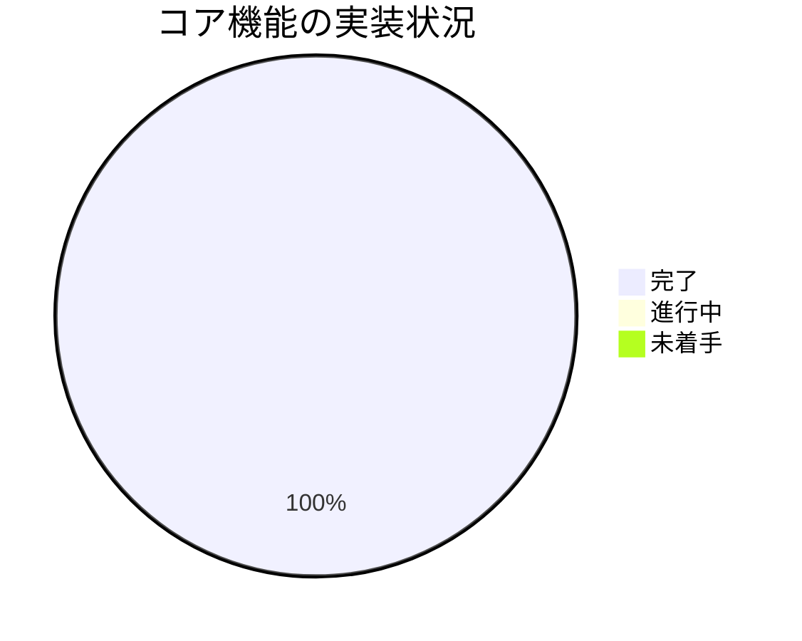
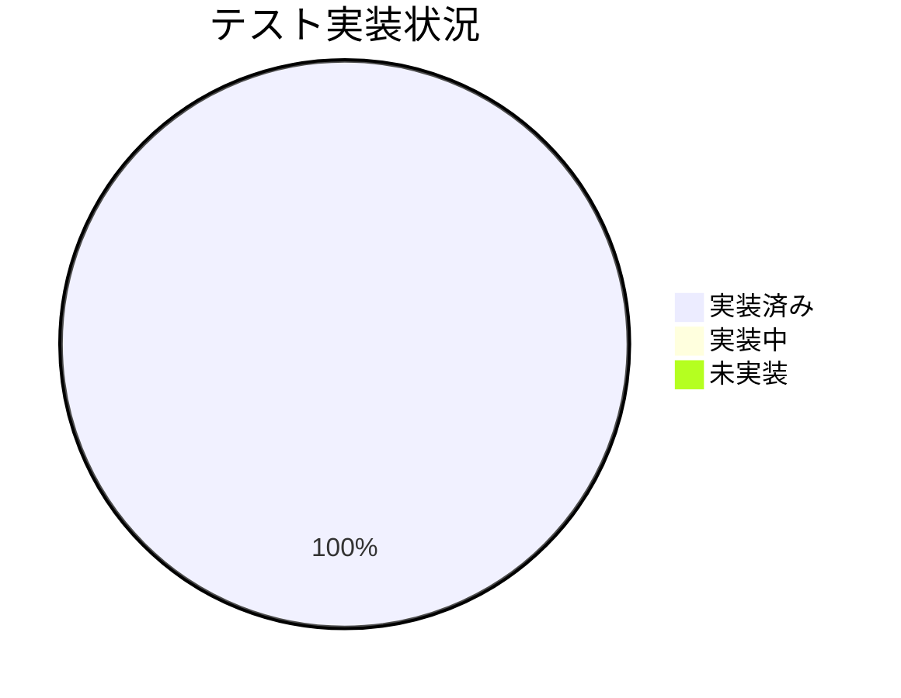

# 進捗状況

## 現在の進捗

### プロジェクト初期化フェーズ
- [x] プロジェクトの要件定義
- [x] アーキテクチャ設計
- [x] 技術スタックの選定
- [x] Memory Bankの作成
- [x] プロジェクトディレクトリ構造の作成
- [x] 初期ファイルの設定

### 基本実装フェーズ
- [x] CLIインターフェースの実装
- [x] YouTube動画情報取得機能の実装
- [x] Gemini API連携の実装
- [x] 要約生成ロジックの実装

### コード修正フェーズ
- [x] Gemini API呼び出しの更新
  - [x] クライアント初期化の修正 (APIキー方式へ)
  - [x] コンテンツ構造の更新
  - [x] ストリーミング機能の追加
- [x] 依存関係の修正
  - [x] `google-genai` パッケージへの変更
  - [x] `requirements.txt` の更新
- [x] 環境設定ファイルの修正
  - [x] `.env.example` から `PROJECT_ID` を削除
- [x] テストコードの更新

### テスト実装フェーズ
- [x] ユニットテストの作成
- [x] テストユーティリティの実装
- [ ] テストの実行（環境セットアップ待ち）
- [ ] カバレッジレポートの確認

### ドキュメント作成フェーズ
- [x] README.mdの作成
- [x] Memory Bankの更新
- [ ] インストールガイドの作成
- [ ] 使用方法ガイドの作成
- [ ] API仕様の文書化
- [ ] トラブルシューティングガイドの作成

## 実装状況

### コア機能

| 機能 | 状態 | 優先度 | 備考 |
|------|------|--------|------|
| プロジェクト設定 | 完了 | 高 | ディレクトリ構造、依存関係設定 |
| CLI基本構造 | 完了 | 高 | 引数処理、オプション管理、ストリーミング対応 |
| YouTube連携 | 完了 | 高 | URL検証、情報取得 |
| Gemini連携 | 完了 | 高 | 新API対応、ストリーミング対応、APIキー認証 |
| 要約生成 | 完了 | 高 | コア要約機能、多言語対応 |

### テスト

| テスト種別 | 状態 | カバレッジ |
|------------|------|------------|
| ユニットテスト | 実装済 | 未検証 |
| 統合テスト | 実装済 | 未検証 |
| E2Eテスト | 実装済 | 未検証 |

## 残タスク

### 優先度: 高
1. 環境セットアップの完了待ち
   - Python環境の準備
   - 依存パッケージのインストール (`pip install -r requirements.txt`)
   - `.env`ファイルの設定 (`GEMINI_API_KEY`)

2. テストの実行と検証
   - `python -m pytest tests/ -v` の実行
   - カバレッジ確認
   - バグ修正（必要に応じて）

3. ドキュメントの整備
   - インストール手順
   - 使用方法
   - APIリファレンス

### 優先度: 中
1. パフォーマンスの最適化
   - ストリーミング処理の効率化
   - エラーハンドリングの改善
   - メモリ使用の最適化

2. ユーザビリティの向上
   - エラーメッセージの改善
   - プログレス表示の最適化
   - ヘルプ情報の充実

### 優先度: 低
1. 追加機能の実装
   - キャッシュ機能
   - バッチ処理
   - 設定ファイル対応

## 既知の課題

### 技術的課題
1. API仕様対応
   - 優先度: 完了
   - 状態: 修正済み
   - 備考: 新しいGemini API仕様に対応完了

2. ストリーミング処理
   - 優先度: 高
   - 状態: 実装済み、テスト待ち
   - 備考: 動作確認が必要

### 運用上の課題
1. 環境セットアップ
   - 優先度: 高
   - 状態: 準備中
   - 対応: Python環境とAPIキーの設定待ち

2. テスト実行
   - 優先度: 高
   - 状態: 準備完了
   - 対応: 環境セットアップ後に実行予定