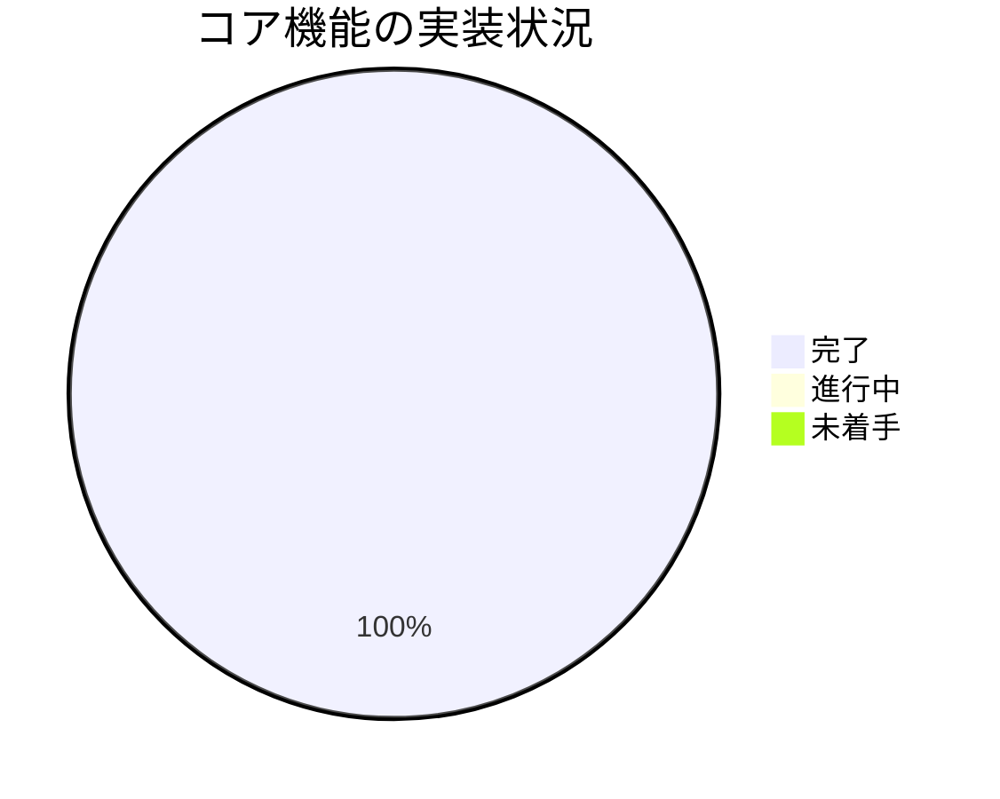
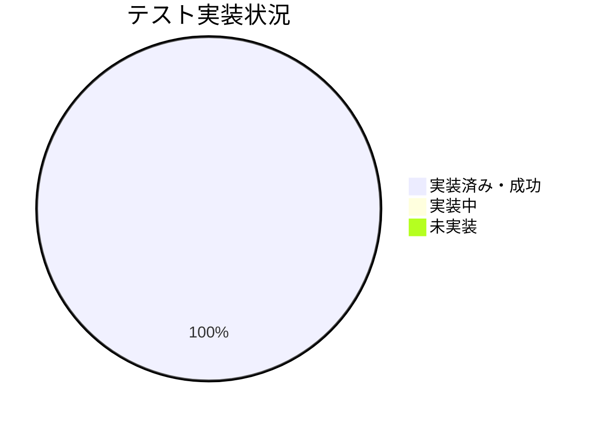

# 進捗状況

## 現在の進捗

### プロジェクト初期化フェーズ
- [x] プロジェクトの要件定義 (初期 + チャプター機能)
- [x] アーキテクチャ設計 (初期 + チャプター機能)
- [x] 技術スタックの選定 (初期)
- [x] Memory Bankの作成と更新
- [x] プロジェクトディレクトリ構造の作成
- [x] 初期ファイルの設定
- [x] `.gitignore` ファイルの作成

### 基本実装フェーズ (要約機能)
- [x] CLIインターフェースの実装
- [x] YouTube動画情報取得機能の実装
- [x] Gemini API連携の実装
- [x] 要約生成ロジックの実装

### コード修正フェーズ (API仕様対応)
- [x] Gemini API呼び出しの更新
- [x] 依存関係の修正
- [x] 環境設定ファイルの修正
- [x] テストコードの更新

### **チャプター機能実装フェーズ**
- [x] チャプター機能の設計
- [x] チャプター生成メソッドの実装 (`gemini.py`)
- [x] チャプター生成処理の実装 (`summarizer.py`)
- [x] CLIオプションと処理の実装 (`cli.py`)
- [x] チャプター機能のテストコード作成

### テスト実装フェーズ
- [x] ユニットテストの作成 (要約・チャプター)
- [x] テストユーティリティの実装
- [x] テストの実行と成功確認 (要約・チャプター)
- [ ] カバレッジレポートの確認 (任意)

### ドキュメント作成フェーズ
- [x] README.mdの作成と更新 (チャプター機能含む)
- [x] Memory Bankの更新 (チャプター機能実装完了)
- [ ] インストールガイドの作成 (READMEに統合済み)
- [ ] 使用方法ガイドの作成 (READMEに統合済み)
- [ ] API仕様の文書化 (任意)
- [ ] トラブルシューティングガイドの作成

## 実装状況

### コア機能 (要約 + チャプター)

| 機能 | 状態 | 優先度 | 備考 |
|------|------|--------|------|
| プロジェクト設定 | 完了 | 高 | - |
| CLI基本構造 | 完了 | 高 | 要約・チャプター対応 |
| YouTube連携 | 完了 | 高 | - |
| Gemini連携 | 完了 | 高 | 要約・チャプター対応 |
| 要約/チャプター生成 | 完了 | 高 | - |

### テスト

| テスト種別 | 状態 | カバレッジ |
|------------|------|------------|
| ユニットテスト | 完了・成功 | 未検証 |
| 統合テスト | 完了・成功 | 未検証 |
| E2Eテスト | 完了・成功 | 未検証 |

## 残タスク

### 優先度: 高
1. コードレビューと最終確認
2. ドキュメントの最終確認 (README, memory-bank)

### 優先度: 中
1. トラブルシューティングガイドの作成
2. パフォーマンス測定と最適化 (必要に応じて)

### 優先度: 低
1. 追加機能の実装 (キャッシュなど)
2. API仕様の文書化

## 既知の課題
- 特になし (テストは成功)

## 次のマイルストーン

### マイルストーン1: 最終確認
目標完了日: 1日以内
- コードレビュー
- ドキュメント確認

### マイルストーン2: (任意) 品質向上
目標完了日: 3日以内
- トラブルシューティングガイド作成
- パフォーマンス改善