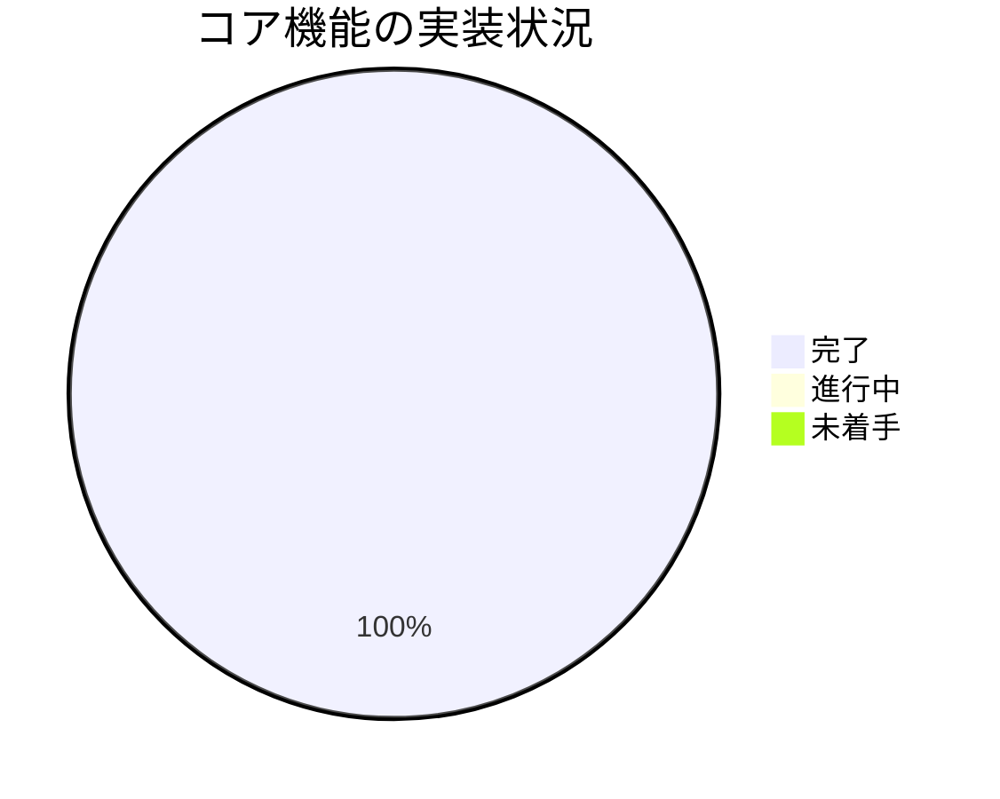
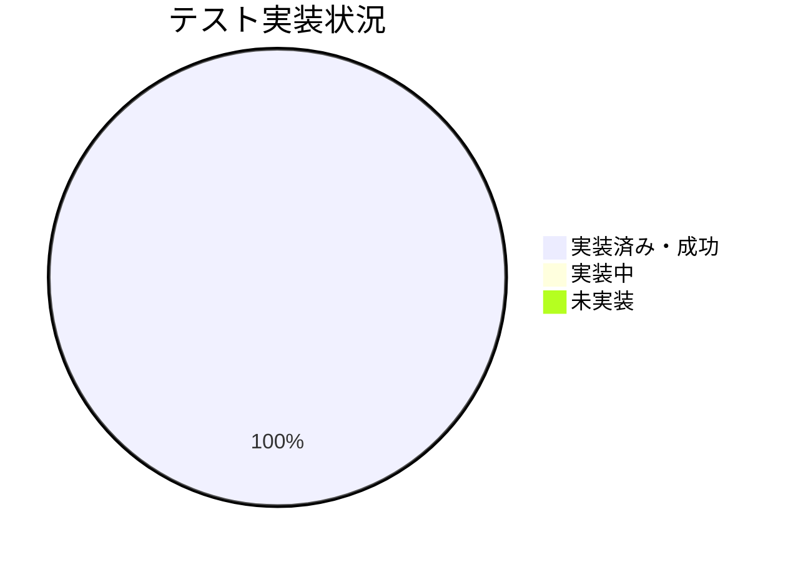

# 進捗状況

## 現在の進捗

### プロジェクト初期化フェーズ
- [x] プロジェクトの要件定義
- [x] アーキテクチャ設計
- [x] 技術スタックの選定
- [x] Memory Bankの作成
- [x] プロジェクトディレクトリ構造の作成
- [x] 初期ファイルの設定
- [x] `.gitignore` ファイルの作成

### 基本実装フェーズ
- [x] CLIインターフェースの実装
- [x] YouTube動画情報取得機能の実装
- [x] Gemini API連携の実装
- [x] 要約生成ロジックの実装

### コード修正フェーズ
- [x] Gemini API呼び出しの更新
- [x] 依存関係の修正
- [x] 環境設定ファイルの修正
- [x] テストコードの更新

### テスト実装フェーズ
- [x] ユニットテストの作成
- [x] テストユーティリティの実装
- [x] テストの実行と成功確認
- [ ] カバレッジレポートの確認 (任意)

### ドキュメント作成フェーズ
- [x] README.mdの作成
- [x] Memory Bankの更新
- [ ] インストールガイドの作成
- [ ] 使用方法ガイドの作成
- [ ] API仕様の文書化
- [ ] トラブルシューティングガイドの作成

## 実装状況

### コア機能

| 機能 | 状態 | 優先度 | 備考 |
|------|------|--------|------|
| プロジェクト設定 | 完了 | 高 | ディレクトリ構造、依存関係設定、gitignore |
| CLI基本構造 | 完了 | 高 | 引数処理、オプション管理、ストリーミング対応 |
| YouTube連携 | 完了 | 高 | URL検証、情報取得 |
| Gemini連携 | 完了 | 高 | 新API対応、ストリーミング対応、APIキー認証 |
| 要約生成 | 完了 | 高 | コア要約機能、多言語対応 |

### テスト

| テスト種別 | 状態 | カバレッジ |
|------------|------|------------|
| ユニットテスト | 完了・成功 | 未検証 |
| 統合テスト | 完了・成功 | 未検証 |
| E2Eテスト | 完了・成功 | 未検証 |

## 残タスク

### 優先度: 高
1. 実環境での動作確認
   - 様々なYouTube URLでのテスト
   - オプションの組み合わせ検証
   - エラーハンドリングの確認

2. ドキュメントの整備
   - README.mdにインストール手順と基本的な使い方を追記
   - `.env`ファイルの設定方法を明記

### 優先度: 中
1. トラブルシューティングガイドの作成
   - よくあるエラーとその対処法をまとめる

2. コードレビューとリファクタリング (必要に応じて)
   - 可読性、保守性の観点で見直し

3. パフォーマンスの最適化 (必要に応じて)
   - 長い動画での応答時間確認

### 優先度: 低
1. 追加機能の実装
   - キャッシュ機能
   - バッチ処理
   - 設定ファイル対応

## 既知の課題
- 特になし (テストは成功)

## 次のマイルストーン

### マイルストーン1: 実環境テストとドキュメント
目標完了日: 1日以内
- 実環境での動作確認
- READMEの更新 (インストール、使い方)

### マイルストーン2: 品質向上と仕上げ
目標完了日: 3日以内
- トラブルシューティングガイド作成
- コードレビューとリファクタリング
- パフォーマンス確認