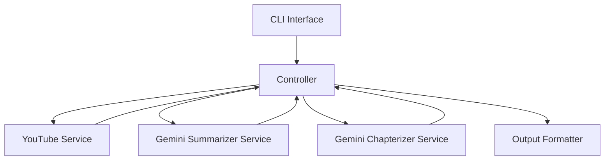

# システムパターン設計

## アーキテクチャ概要

### 全体構造 (更新)


## コンポーネント設計 (更新)

### 1. CLIインターフェース（cli.py）
- コマンドライン引数の解析 (チャプター生成オプション追加)
- 入力バリデーション
- ヘルプメッセージの提供
- エラーメッセージの表示
- **要約またはチャプター結果の表示**

### 2. コントローラー（summarizer.py -> controller.py にリネーム検討）
- ビジネスロジックの制御
- サービス間の連携 (要約/チャプター生成の振り分け)
- エラーハンドリング
- 結果の集約

### 3. YouTubeサービス（youtube.py）
- URL検証
- 動画情報の取得
- メタデータの抽出
- エラー状態の検出

### 4. Gemini要約サービス（gemini_summarizer.py に分離検討）
- API認証
- 要約モデル設定
- 要約プロンプト生成
- 要約レスポンス処理

### 5. Geminiチャプター生成サービス（gemini_chapterizer.py 新設）
- API認証
- チャプター生成モデル設定
- チャプター生成プロンプト生成
- チャプターレスポンス処理 (タイムスタンプと説明の抽出)

### 6. 出力フォーマッター (output_formatter.py 新設検討)
- テキスト形式での要約/チャプター表示
- JSON形式での要約/チャプター表示

## デザインパターン

### 1. Factory Pattern
- モデルインスタンスの生成 (要約/チャプター)
- 出力フォーマッターの生成

### 2. Strategy Pattern
- 異なる要約戦略の実装
- **異なるチャプター生成戦略の実装 (将来的な拡張)**
- 出力形式の切り替え

### 3. Singleton Pattern
- API クライアントの管理
- 設定の管理

### 4. Command Pattern
- CLIコマンドの実装 (要約/チャプター生成コマンド)
- 操作の抽象化

## エラーハンドリング

### エラーの種類
1. 入力エラー
2. APIエラー (YouTube/Gemini)
3. ネットワークエラー
4. **チャプター生成エラー (内容解析不能など)**

### エラー処理戦略
(変更なし)

## データフロー (更新)

### 1. 入力処理
```mermaid
graph LR
    Input[URLとオプション(要約/チャプター)] --> Validate[入力検証]
    Validate --> Parse[パラメータ解析]
    Parse --> Controller[コントローラー]
```

### 2. 要約生成


### 3. チャプター生成


## 設定管理
(変更なし)

## スケーラビリティ考慮事項
(変更なし)