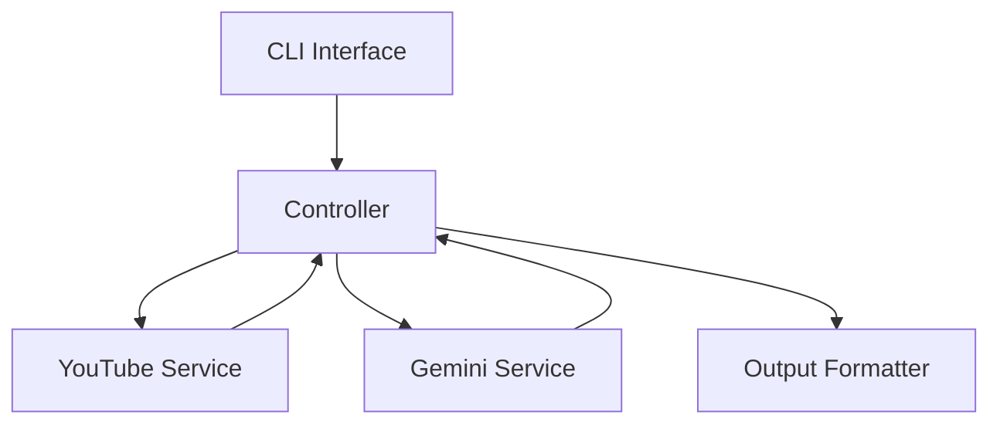
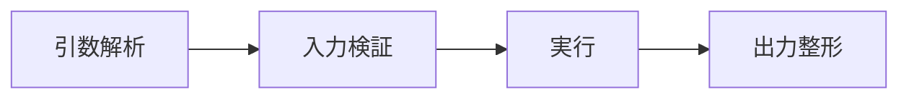
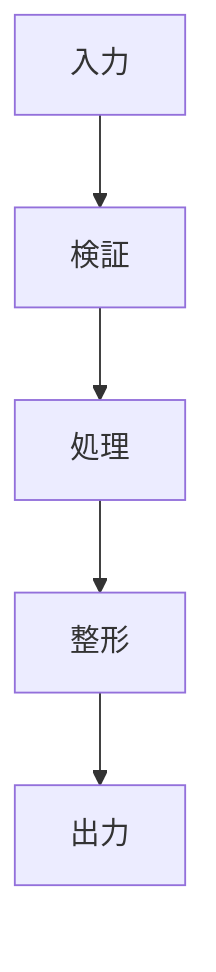
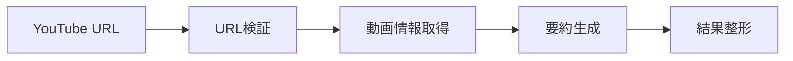
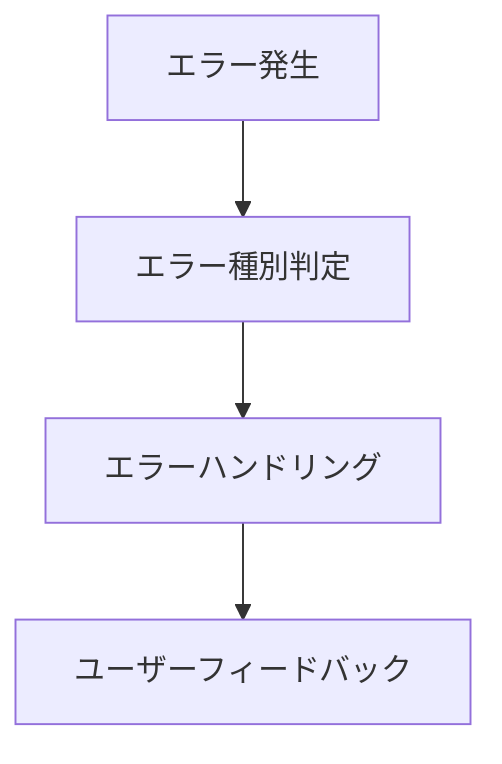

# システムパターン設計

## アーキテクチャ概要

### 全体構造


## コンポーネント設計

### 1. CLIインターフェース（cli.py）


- 責務
  - コマンドライン引数の解析
  - 入力バリデーション
  - ヘルプメッセージの提供
  - エラーメッセージの表示

### 2. コントローラー（summarizer.py）


- 責務
  - ビジネスロジックの制御
  - サービス間の連携
  - エラーハンドリング
  - 結果の集約

### 3. YouTubeサービス（youtube.py）
- 責務
  - URL検証
  - 動画情報の取得
  - メタデータの抽出
  - エラー状態の検出

### 4. Geminiサービス（gemini.py）
- 責務
  - API認証
  - モデル設定
  - プロンプト生成
  - レスポンス処理

## デザインパターン

### 1. Factory Pattern
- 用途
  - モデルインスタンスの生成
  - 出力フォーマッターの生成
```python
class ModelFactory:
    @staticmethod
    def create_model(model_type: str) -> GeminiModel:
        if model_type == "flash":
            return GeminiFlashModel()
        elif model_type == "pro":
            return GeminiProModel()
```

### 2. Strategy Pattern
- 用途
  - 異なる要約戦略の実装
  - 出力形式の切り替え
```python
class SummaryStrategy(ABC):
    @abstractmethod
    def summarize(self, content: str) -> str:
        pass

class ShortSummary(SummaryStrategy):
    def summarize(self, content: str) -> str:
        # 短い要約を生成
        pass
```

### 3. Singleton Pattern
- 用途
  - API クライアントの管理
  - 設定の管理
```python
class GeminiClient:
    _instance = None

    @classmethod
    def get_instance(cls):
        if cls._instance is None:
            cls._instance = cls()
        return cls._instance
```

## エラーハンドリング

### エラーの種類と処理
1. 入力エラー
```python
class URLValidationError(Exception):
    pass

class OptionValidationError(Exception):
    pass
```

2. APIエラー
```python
class APILimitError(Exception):
    pass

class AuthenticationError(Exception):
    pass
```

3. ネットワークエラー
```python
class NetworkTimeoutError(Exception):
    pass

class ConnectionError(Exception):
    pass
```

## データフロー

### 1. 要約生成フロー


### 2. エラー処理フロー


## 設定管理

### 1. 環境変数
```python
GEMINI_API_KEY=your_api_key
DEFAULT_MODEL=gemini-2.0-flash-001
DEFAULT_LANGUAGE=ja
```

### 2. ユーザー設定
```python
class UserConfig:
    def __init__(self):
        self.model = "flash"
        self.format = "text"
        self.language = "ja"
```

## 拡張性考慮

### 1. 新機能追加
- プラグイン形式でのモデル追加
- カスタムフォーマッター追加
- 新しい要約戦略の実装

### 2. パフォーマンス最適化
- キャッシュ機能
- 並行処理
- バッチ処理

### 3. テスト戦略
- ユニットテスト
- 統合テスト
- モック活用